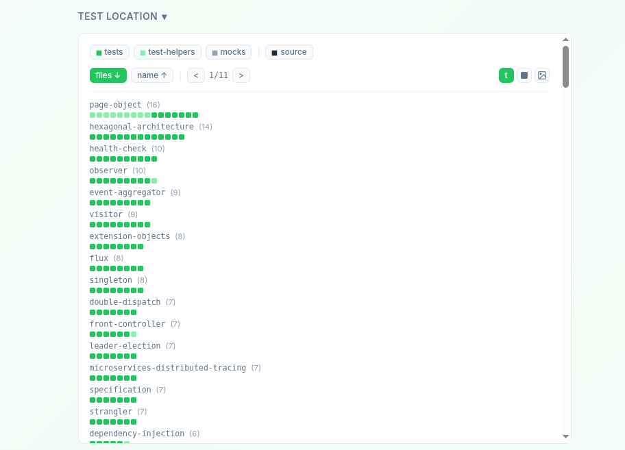

# Explorando Práticas de Teste

Neste exercício, vamos explorar práticas de teste em sistemas reais utilizando a ferramenta [TestMiner](https://andrehora.github.io/testminer).

O TestMiner permite visualizar e analisar testes de software em repositórios do GitHub, fornecendo dados sobre como os projetos organizam seus testes, como eles evoluem entre versões e quais bibliotecas de teste são utilizadas.
Explore a ferramenta antes de começar para se familiarizar com seu funcionamento.

---

## Passo 1: Selecionar um repositório

Escolha um repositório real que possua testes escritos na linguagem de sua preferência.
Abaixo estão alguns links para ajudá-lo a encontrar projetos interessantes:

- **Python:** https://github.com/topics/python?l=python
- **JavaScript:** https://github.com/topics/javascript?l=javascript
- **TypeScript:** https://github.com/topics/typescript?l=typescript
- **Java:** https://github.com/topics/java?l=java

## Passo 2: Explorar o repositório selecionado

Busque o repositório escolhido no [TestMiner](https://andrehora.github.io/testminer) e analise os dados de teste gerados pela ferramenta.

## Passo 3: Explicar uma prática de teste

Com base nos dados obtidos, selecione uma prática ou dado de teste relevante e explique-o com suas próprias palavras.

---

## Instruções de entrega

1. Faça um `fork` deste repositório (saiba mais sobre forks [aqui](https://docs.github.com/pt/pull-requests/collaborating-with-pull-requests/working-with-forks/fork-a-repo)).
2. Responda às questões abaixo diretamente neste arquivo `README.md` do seu fork. Pode adicionar imagens para enriquecer sua explicação.
3. No Moodle, submeta apenas a URL do seu fork.

---

## Respostas

**1. Repositório selecionado:** `https://github.com/iluwatar/java-design-patterns`

**2. Explicação:** Uma prática de teste observada no repositório é a organização dos testes de acordo com os padrões de projeto implementados. Cada padrão, como Singleton, Observer e Dependency Injection, possui sua própria estrutura de testes dedicada.

Essa abordagem facilita a manutenção e a compreensão dos testes, pois permite validar o comportamento específico de cada padrão de forma isolada. Além disso, o uso de bibliotecas como JUnit (especialmente JUnit Jupiter) indica a adoção de testes unitários modernos, com foco em automatização e repetibilidade.

Outra prática relevante é o uso de mocks, por meio da biblioteca Mockito, que permite simular dependências e testar componentes de forma independente. Isso melhora a confiabilidade dos testes e reduz o acoplamento com outras partes do sistema.

